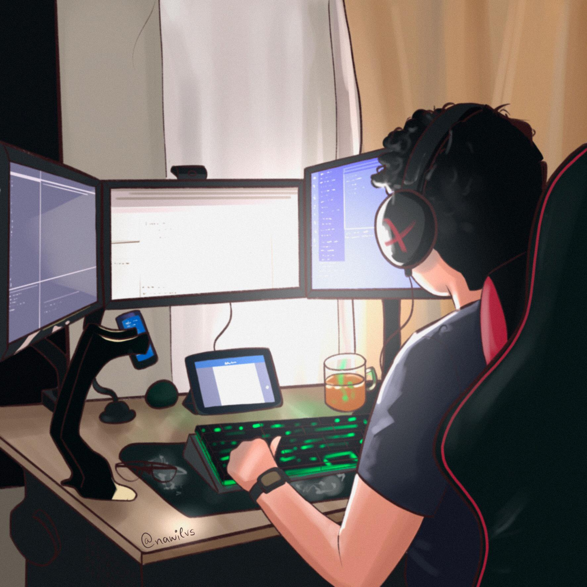
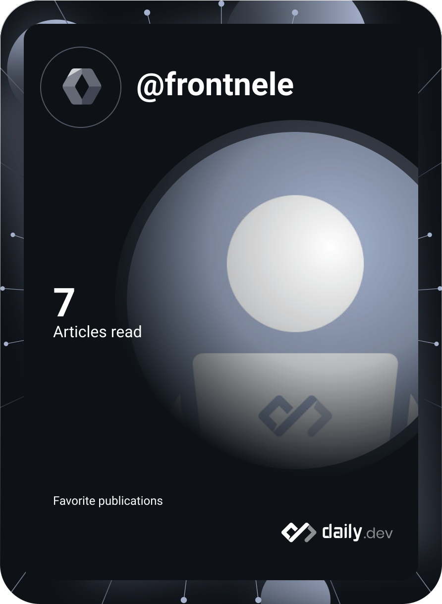

  

  
  
  
  
  

---

### 👋 Hi, I'm Lucas

Software engineer since **2017**, fascinated by technology and by turning ideas into products people actually use.

- 🏢 Software Engineer at **Softwise**
- 📍 Based in **Palmas, Brasil**
- 🧱 Backend with **.NET** and **Node.js** (NestJS, DDD, Clean Architecture, microservices)
- 🎨 Frontend & mobile with **React, Next.js and React Native**
- 🌱 Exploring **Flutter** and modern web architecture
- 💬 Ask me about APIs, frontend architecture, or shipping products end to end
- 📫 Reach me at **contato@fontinele.dev**

 

### 🛠️ Tech stack

  
   
  

### 📊 GitHub stats

  
  

  

  

### 🪪 daily.dev

  

